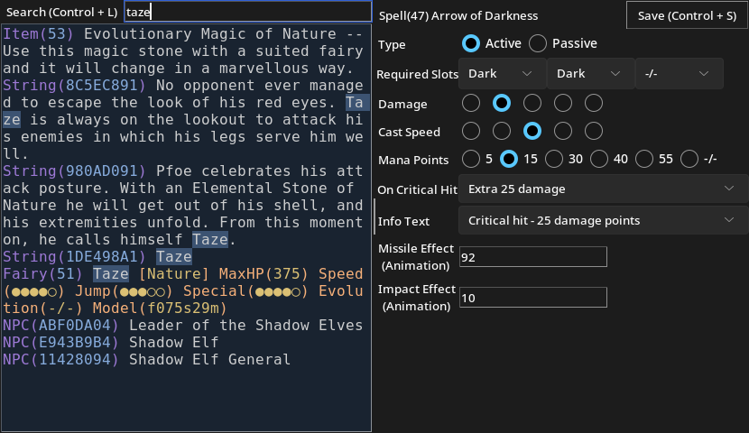
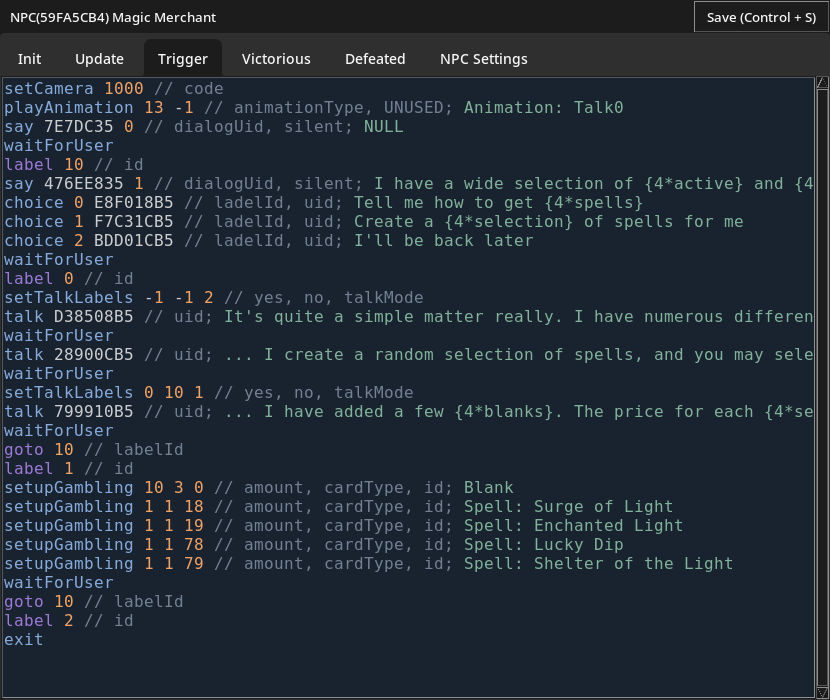
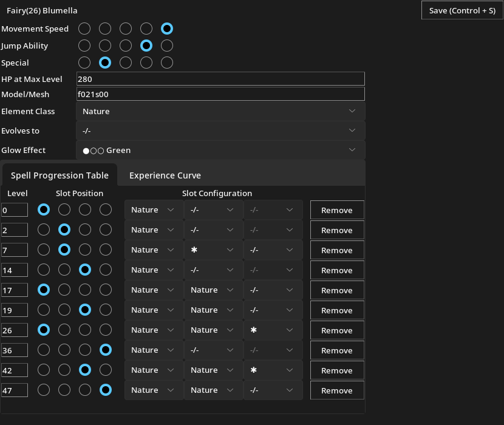
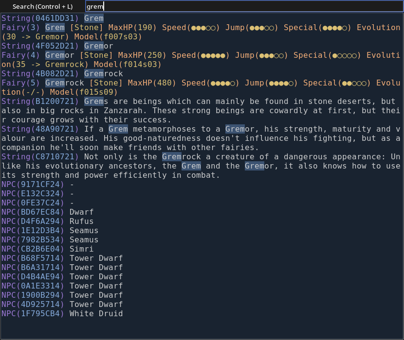

Database editor for modifying the game _"ZanZarah - The Hidden Portal"_.

# Features

* Fast, incremental search for finding related things. E.g. searching for `tinefol` will also list
  all dialog texts, items and NPCs related to Tinefol
* Script decompiler which injects useful comments into code

See the screenshot section below for more features.

# Installation

## Windows

Install python 3.11 (or higher). The installer includes tkinter and idlelib by default, which are
required by this script. Then run the following command from a cmd prompt:

```sh
pip install --upgrade matplotlib Pillow sv-ttk
```

## Fedora Linux

```sh
sudo dnf install python3-tkinter python3-idle
pip install --upgrade matplotlib Pillow sv-ttk
```

# Usage

This script can't edit the FBS files in the game directly. They have to be converted to an SQLite
database first. Tools for converting back and forth can be found here: https://github.com/Helco/zzio

The script takes two optional arguments:

```sh
./zanzarah-database-editor.py ../path/to/database.db "command-to-run-after-saving"
```

Further informations related to scripting and more can be found here: https://helco.github.io/zzdocs

# Screenshots




